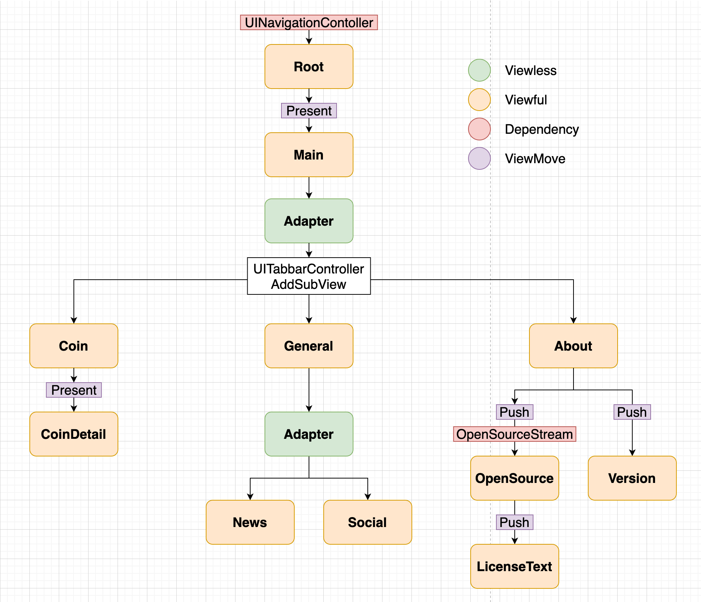

# CoinCraft
--------------
## An app to demonstrate RIBs, Uber's newest mobile architecture.

# Language
--------------
## Swift5.0

# Used Libarary
--------------
[RIBs Swift](https://github.com/uber/RIBs)   
[RxSwift](https://github.com/ReactiveX/RxSwift)   
[Lottie-ios](https://github.com/airbnb/lottie-ios)   
[Alamofire](https://github.com/Alamofire/Alamofire)   
[SwiftyJSON](https://github.com/SwiftyJSON/SwiftyJSON)

# Architecture
--------------
## Based on Uber's RIBs architecture. https://github.com/uber/RIBs/wiki

